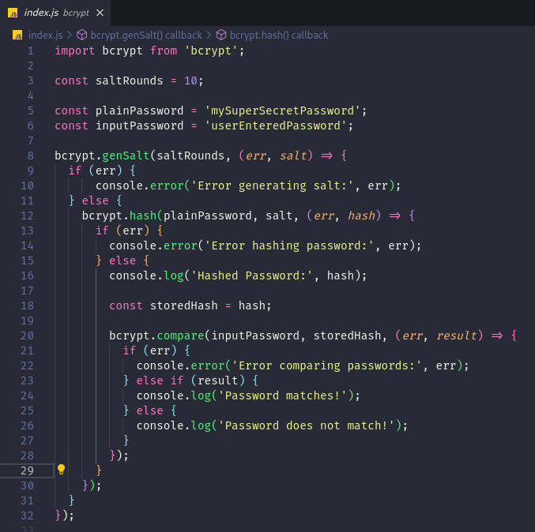

# Bcrypt - Cryptographic Hashing

#### Start Server (YARN)
```
-> yarn

-> yarn start
```

#### Start Server (NPM)
```
-> npm install

-> npm run start
```

<p align="center">
  
</p>

In this example:

1. We require the **bcrypt** module.
2. We define the number of salt rounds.
3. We generate a salt using **bcrypt.genSalt()**.
4. We use the generated salt to hash the plain password using **bcrypt.hash()**.
5. We store the resulting hash in the database.
6. Later, when authenticating a user, we retrieve the stored hash from the database.
7. We use **bcrypt.compare()** to compare the input password with the stored hash. If they match, authentication is successful.


Bcrypt is a widely-used cryptographic hashing function designed specifically for password hashing. It's commonly used in web development for securely storing user passwords in databases. Here's an explanation of its key concepts:

1. **Hashing Function**:
Bcrypt is a one-way cryptographic hashing function. Unlike encryption algorithms, hashing algorithms are not reversible. You can't reverse the process to obtain the original input from the hash. This one-way nature makes it ideal for securely storing passwords.

2. **Salting**:
Salting is a technique used to add additional randomness to the hashed output, making it harder to crack using precomputed hash tables or rainbow tables. Bcrypt automatically generates and manages a salt for each hash it produces, ensuring that each password hash is unique.

3. **Cost Factor**:
Bcrypt allows you to specify a "cost factor" or "work factor" that determines how computationally expensive the hash function is. Increasing the cost factor makes the hash function slower, which increases the time required for an attacker to brute-force the hash. This helps mitigate the risk of brute force attacks.

4. **Resistance to Brute-Force Attacks**:
Bcrypt is designed to be slow and computationally expensive. This means that even with increasing computing power, it remains resistant to brute-force attacks. The combination of salting and the adjustable cost factor makes it significantly more difficult and time-consuming for attackers to crack hashed passwords.

5. **Security Best Practices**:
When using bcrypt for password hashing, it's important to follow security best practices such as using a strong salt, choosing an appropriate cost factor, and securely storing the hashed passwords in your database. Additionally, bcrypt handles the salting and hashing process internally, abstracting away much of the complexity involved in securely hashing passwords.